# UX/UI Designer | Product Manager | Full-Stack Developer

### Hola, soy María Luz👋

Diseñadora UX/UI especializada en coordinación y gestión de proyectos. Estudio la Tecnicatura en Programación en la UTN.

En **Estructura de Impacto**, dirijo proyectos de diseño y rebranding que priorizan el impacto comunitario positivo.

**Metodología:** Product Manager-mindset. Trabajo orientado a resultados con énfasis en UX research y procesos de coordinación ágiles.

&nbsp;

&nbsp;

---

## 🔧 Stack técnico

**Diseño**

**Desarrollo**

**Gestión**

**IA**

---

  

